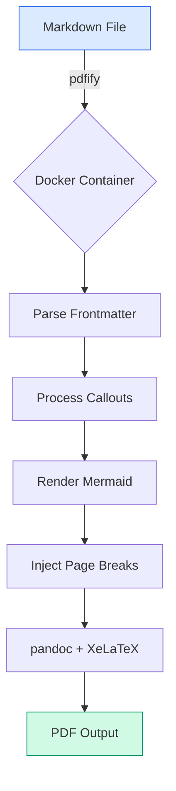
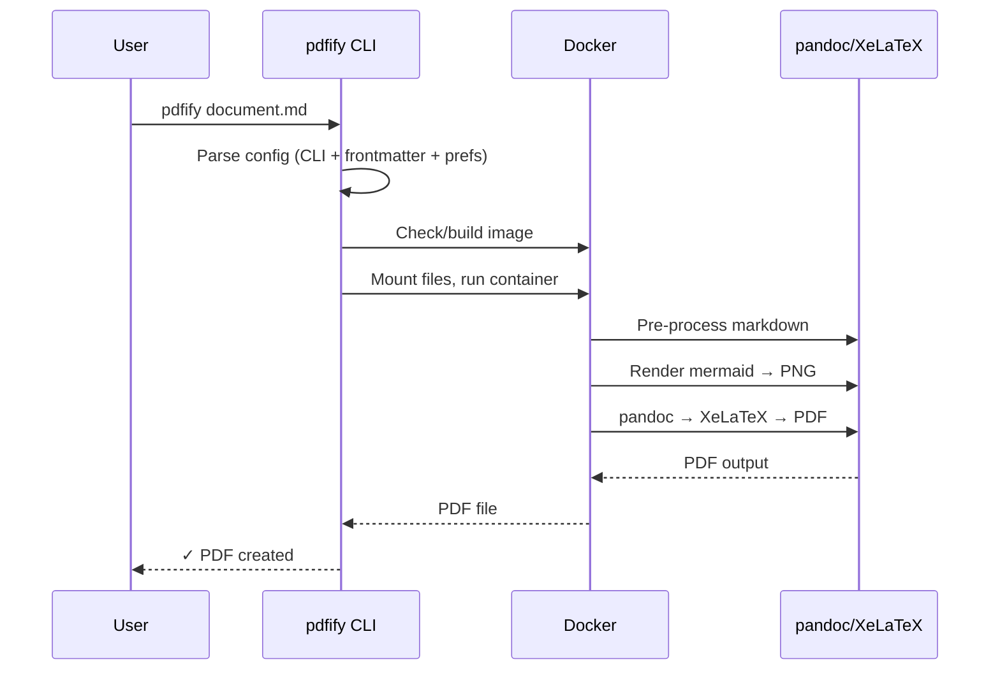
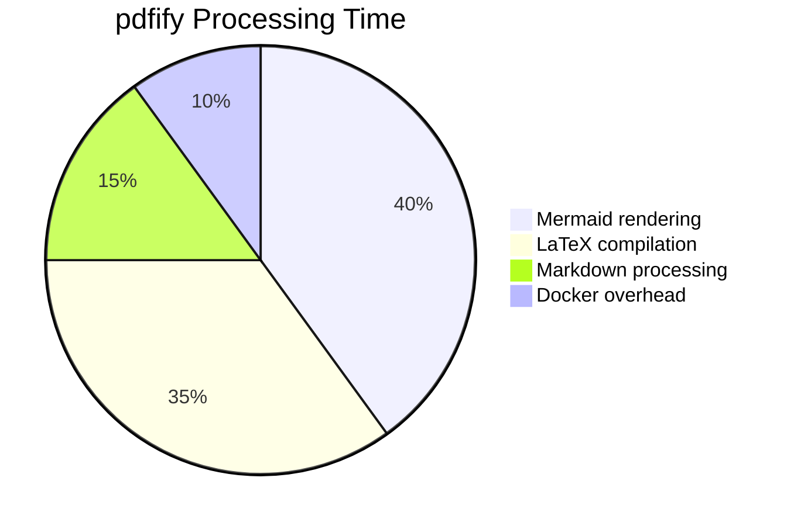

# Full Feature Showcase

This document exercises every feature that pdfify supports. Use it as a stress test and reference.

## Text Formatting

Regular text, **bold**, *italic*, ***bold italic***, `inline code`, and ~~strikethrough~~.

Special characters that need LaTeX escaping: 100% of $users & #1 priority with under_scores and {braces}.

## Headings at Every Level

### Third Level Heading

Some content under H3.

#### Fourth Level Heading

Some content under H4.

## Code Blocks

### Go

```go
// Package main demonstrates a simple HTTP server.
package main

import (
    "fmt"
    "log"
    "net/http"
)

func main() {
    http.HandleFunc("/", func(w http.ResponseWriter, r *http.Request) {
        fmt.Fprintf(w, "Hello, pdfify! You requested: %s", r.URL.Path)
    })
    log.Fatal(http.ListenAndServe(":8080", nil))
}
```

### Python

```python
from dataclasses import dataclass
from typing import Optional

@dataclass
class Document:
    title: str
    author: str
    pages: int
    theme: Optional[str] = "default"

    def summary(self) -> str:
        return f"{self.title} by {self.author} ({self.pages} pages)"
```

### Shell

```bash
#!/bin/bash
set -euo pipefail

echo "Building pdfify..."
CGO_ENABLED=0 go build -ldflags="-s -w" -o bin/pdfify ./cmd/pdfify
echo "Done! Binary: $(du -h bin/pdfify | cut -f1)"
```

### JSON

```json
{
  "title": "My Document",
  "theme": "default",
  "paper_size": "letter",
  "toc_level": 3,
  "features": ["callouts", "mermaid", "tables", "code"]
}
```

## Tables

### Simple Table

| Feature | Supported | Notes |
|---------|-----------|-------|
| Markdown | Yes | Full CommonMark spec |
| Mermaid | Yes | Rendered via mermaid-cli |
| Callouts | Yes | Obsidian-style |
| Themes | Yes | default, party |
| Paper sizes | Yes | letter, a4, a5, legal, executive |

### Wide Table with Long Content

| Setting | CLI Flag | Frontmatter | Preferences | Default | Description |
|---------|----------|-------------|-------------|---------|-------------|
| Title | `--title` | `title:` | `title:` | *(none)* | Document title in header banner |
| Theme | `--theme` | `theme:` | `theme:` | `default` | Visual theme for colors and fonts |
| Paper Size | `--paper` | `papersize:` | `paper_size:` | `letter` | Output page size |
| TOC Level | `--toc-level` | `toc-level:` | `toc_level:` | `3` | Table of contents depth (0=off) |
| Numbering | `--numbers` | `numbersections:` | `number_sections:` | `true` | Enable section numbering |

## Callouts

> [!info] Information
> This is an informational callout. Use it for general notes and background information
> that the reader should be aware of.

> [!tip] Pro Tip
> Tips provide helpful advice and best practices. This is especially useful for
> shortcuts and efficiency improvements.

> [!warning] Warning
> Warnings alert the reader to potential issues or things to be careful about.
> Pay attention to these.

> [!danger] Critical
> Danger callouts indicate serious issues that could cause data loss, security
> vulnerabilities, or system failures.

> [!example] Example
> Example callouts can be used to show concrete implementations or use cases.
> They provide a purple-themed visual distinction.

> [!quote] Notable Quote
> "The best way to predict the future is to invent it." — Alan Kay
>
> Quote callouts provide attribution and visual distinction for quoted material.

## Mermaid Diagrams

### Flowchart



### Sequence Diagram



### Pie Chart



## Lists (Nested and Mixed)

- Top level bullet
  - Nested bullet
    - Deep nested
  - Another nested
- Second top level
  1. Ordered inside unordered
  2. Second ordered
  3. Third ordered
- Third top level

1. First ordered
2. Second ordered
   - Bullet inside ordered
   - Another bullet
3. Third ordered

## Blockquotes

> This is a standard blockquote with multiple lines.
> It should render with a blue left border and light background.

> Blockquotes can contain **formatting**, `code`, and other inline elements.

## Links and References

- [pdfify on GitHub](https://github.com/jclement/pdfify)
- [Pandoc Documentation](https://pandoc.org/)
- [XeLaTeX](https://www.ctan.org/pkg/xetex)
- [Mermaid Diagrams](https://mermaid.js.org/)

## Horizontal Rules

Above the rule.

---

Below the rule.

## Long Content for Page Break Testing

This section contains enough content to force page breaks, testing that our page layout
and headers/footers work correctly across multiple pages.

Lorem ipsum dolor sit amet, consectetur adipiscing elit. Sed do eiusmod tempor incididunt
ut labore et dolore magna aliqua. Ut enim ad minim veniam, quis nostrud exercitation
ullamco laboris nisi ut aliquip ex ea commodo consequat. Duis aute irure dolor in
reprehenderit in voluptate velit esse cillum dolore eu fugiat nulla pariatur.

Excepteur sint occaecat cupidatat non proident, sunt in culpa qui officia deserunt mollit
anim id est laborum. Sed ut perspiciatis unde omnis iste natus error sit voluptatem
accusantium doloremque laudantium, totam rem aperiam, eaque ipsa quae ab illo inventore
veritatis et quasi architecto beatae vitae dicta sunt explicabo.

Nemo enim ipsam voluptatem quia voluptas sit aspernatur aut odit aut fugit, sed quia
consequuntur magni dolores eos qui ratione voluptatem sequi nesciunt. Neque porro
quisquam est, qui dolorem ipsum quia dolor sit amet, consectetur, adipisci velit.

## Special Characters

These characters should be properly escaped in the PDF output:

- Ampersand: &
- Dollar sign: $
- Percent: %
- Hash: #
- Underscore: _
- Curly braces: { }
- Tilde: ~
- Caret: ^
- Backslash: \

## Heading with `code` and [brackets]

This heading tests that inline code and square brackets in headings don't break the LaTeX compilation (they require special handling via the Lua filter).

---

*End of full feature showcase.*
