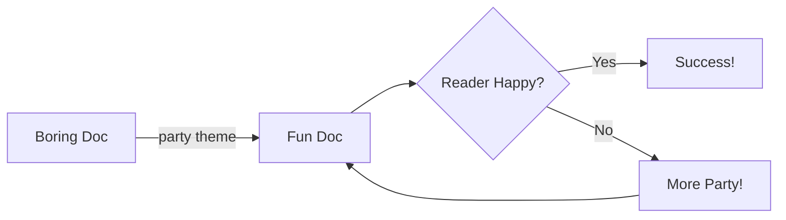

# Party Theme Demo

This document uses the **party** theme — vibrant colors, bold headings, and maximum personality.

## Callouts in Party Mode

> [!info] Party Info
> The party theme uses purple as its primary accent color, with bright
> complementary colors for all callout types.

> [!tip] Party Tip
> Even in party mode, your documents remain professional. Just... more fun.

> [!warning] Party Warning
> Too much party can be overwhelming. Use responsibly.

> [!danger] Party Danger
> This theme may cause your colleagues to ask what tool you're using.

> [!example] Party Example
> The party theme changes colors for code blocks, tables, headings,
> callouts, and even mermaid diagrams.

## Code in Party Mode

```go
func party() string {
    themes := []string{"default", "party"}
    return themes[1] // always party
}
```

## Tables in Party Mode

| Theme | Vibe | Best For |
|-------|------|----------|
| Default | Professional | Business docs |
| Party | Fun | Everything else |

## Mermaid in Party Mode



---

*Party on!*
